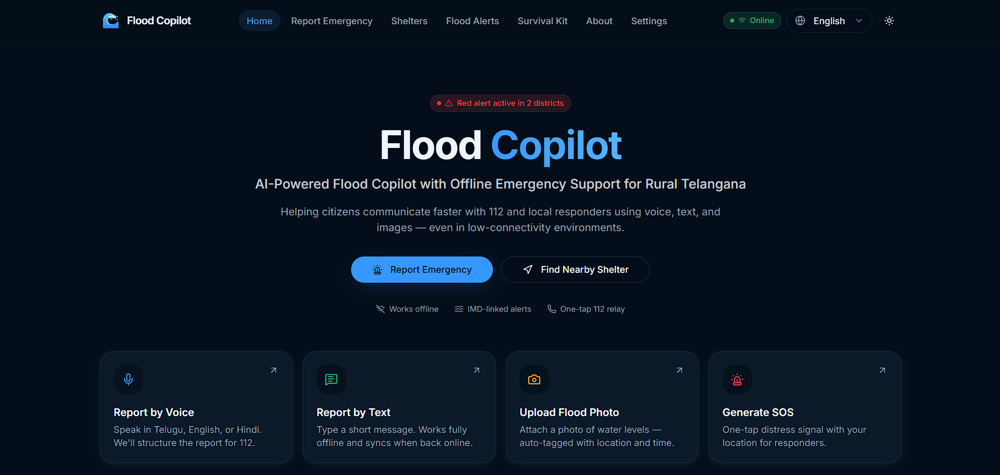
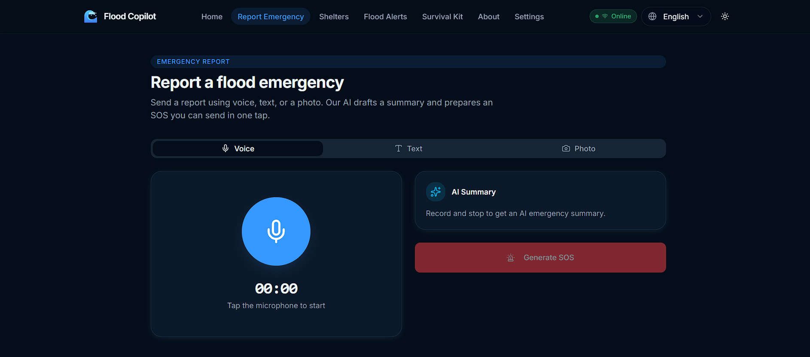
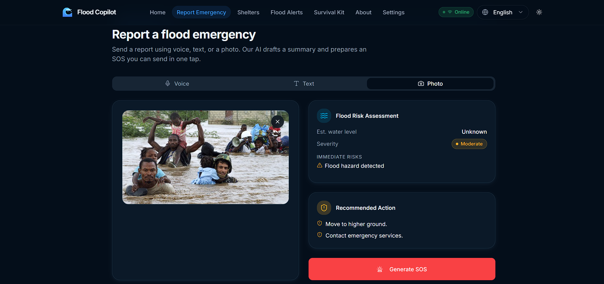
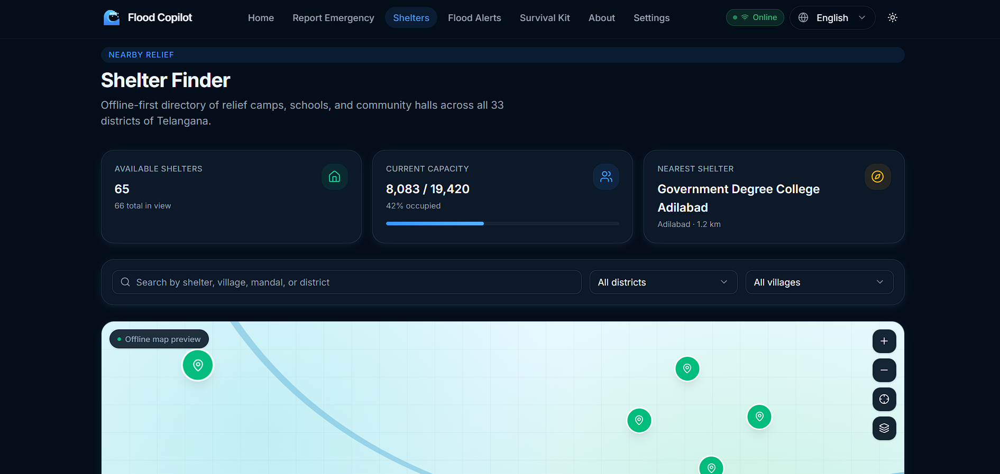
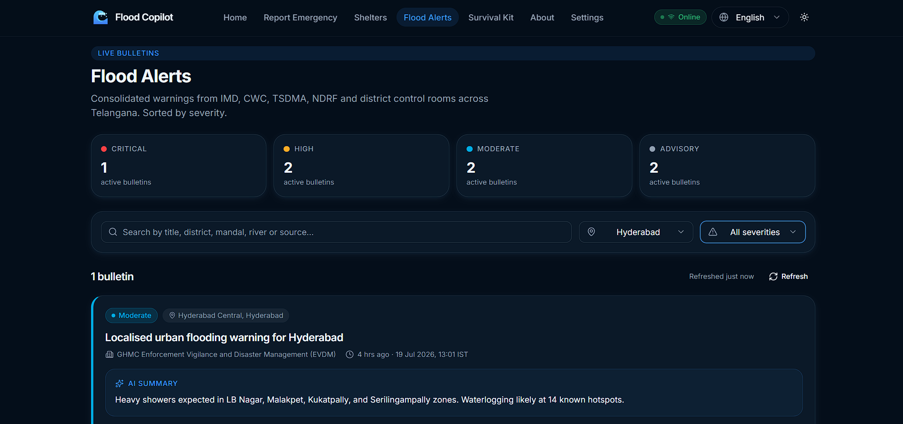
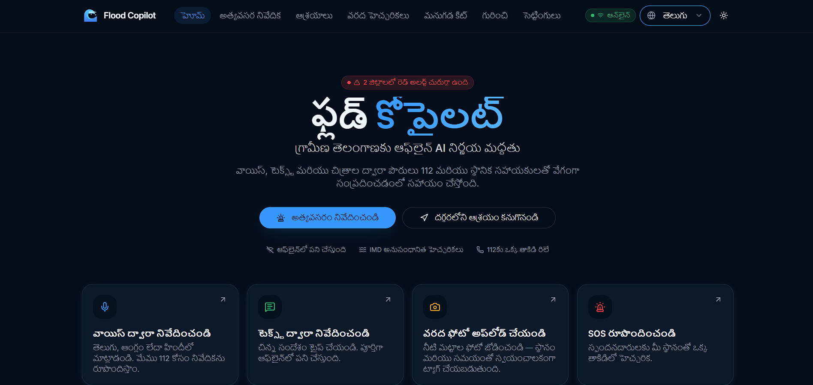

# 🌊 Flood Copilot

> **AI-Powered Multilingual Flood Emergency Assistant for Rural Telangana**

Flood Copilot is an AI-powered disaster response platform that enables citizens to report flood emergencies using **voice, text, or images**, receive intelligent emergency guidance, generate structured SOS messages, locate nearby shelters, and stay informed through official flood alerts—all in **English, Telugu, and Hindi**.

---

## 🚀 Live Demo

🌐 **Frontend:** https://flood-copilot.vercel.app

⚙️ **Backend Health:** https://flood-copilot.onrender.com/api/health

---

## Built For

**NxtWave Online Hackathon 2026**

Theme: Crisis Management, HealthTech & Emergency Response

---

## 📌 Problem Statement

Floods are among the most devastating natural disasters in India, especially in rural regions where communication barriers, low digital literacy, and poor connectivity delay emergency response.

During emergencies, citizens often struggle to:

- Communicate their situation clearly
- Report emergencies in their native language
- Identify nearby relief shelters
- Access verified flood alerts
- Generate structured SOS messages for emergency responders

Flood Copilot addresses these challenges using AI to simplify emergency communication and improve disaster response.

---

# 💡 Solution

Flood Copilot is an intelligent emergency assistant that helps users:

- 🎙 Report emergencies through voice
- 📝 Describe incidents using text
- 📸 Upload flood images for AI analysis
- 🆘 Generate structured SOS messages
- 🏠 Locate nearby relief shelters
- 🚨 View official flood alerts
- 🌐 Interact in English, Telugu, or Hindi
- 📴 Access emergency resources even during poor connectivity

---

# ✨ Key Features

| Feature | Description |
|---------|-------------|
| 🎙 Voice Reporting | AI converts spoken emergencies into structured summaries |
| 📝 Text Reporting | AI analyzes user descriptions and generates emergency summaries |
| 📸 Flood Image Analysis | AI estimates severity, water level, risks, and rescue recommendations |
| 🆘 SOS Generator | Creates structured emergency messages ready for 112 or local responders |
| 🏠 Shelter Finder | Search relief shelters by district with live availability |
| 🚨 Flood Alerts | Displays flood bulletins and weather alerts |
| 🌐 Multilingual Support | Supports English, Telugu, and Hindi throughout the application |
| 🔄 Automatic Language Detection | AI recognizes the user's language and responds accordingly |
| 📴 Survival Kit | Offline emergency contacts, first-aid guidance, and preparedness checklist |

---

# 🧠 AI Workflow

```
            Voice
               │
               ▼
Text ─────► AI Processing ◄──── Image
               │
               ▼
      Language Detection
               │
               ▼
      Structured AI Summary
               │
               ▼
      Risk Assessment
               │
               ▼
      SOS Generation
               │
               ▼
      Emergency Response
```

---

# 📷 Screenshots

> Replace these images with your actual screenshots.

## 🏠 Home



---

## 🚨 Report Emergency



---

## 📸 AI Image Analysis



---

## 🏠 Shelter Finder



---

## 🚨 Flood Alerts



---

## 🌐 Multilingual Support



---

# 🏗️ System Architecture

```
                 User
                  │
      ┌───────────┼───────────┐
      │           │           │
   Voice        Text       Image
      │           │           │
      └───────────┼───────────┘
                  ▼
          React Frontend
       (TanStack Start SSR)
                  │
                  ▼
          Express.js Backend
                  │
      ┌───────────┼───────────┐
      │           │           │
      ▼           ▼           ▼
  Groq AI     Shelter DB   Alerts DB
      │
      ▼
 AI Summary / SOS / Translation
```

---

# 🛠 Technology Stack

| Category | Technology |
|-----------|------------|
| Frontend | React 19 |
| Framework | TanStack Start |
| Styling | Tailwind CSS v4 |
| UI Components | shadcn/ui |
| Backend | Node.js + Express.js |
| AI Platform | Groq |
| AI Models | Llama 3, Vision Model |
| Deployment | Vercel + Render |
| Package Manager | Bun (Frontend), npm (Backend) |

---

# 🤖 AI Models Used

| Model | Purpose |
|---------|---------|
| Llama 3 | AI Chat Assistant |
| Llama 3 | Voice Summary Generation |
| Llama 3 | SOS Generation |
| Llama 3 | Translation |
| Vision Model | Flood Image Risk Assessment |

---

# 🚀 Quick Start

## Prerequisites

- Node.js 18+
- Bun
- Groq API Key

---

## Clone Repository

```bash
git clone https://github.com/yourusername/flood-copilot.git

cd flood-copilot
```

---

## Install Dependencies

Frontend

```bash
bun install
```

Backend

```bash
cd backend

npm install

cd ..
```

---

## Configure Environment Variables

Backend

```
backend/.env
```

```
GROQ_API_KEY=YOUR_API_KEY
PORT=8000
NODE_ENV=development
```

Frontend

```
.env
```

```
VITE_API_URL=http://localhost:8000/api
```

---

## Start Development Server

Frontend

```bash
bun run dev
```

Backend

```bash
cd backend

npm start
```

Open

```
http://localhost:5000
```

---

# 📡 REST API

## GET Endpoints

| Endpoint | Description |
|------------|------------|
| GET /api/health | Health Check |
| GET /api/shelters | Shelter List |
| GET /api/alerts | Flood Alerts |
| GET /api/tips | Safety Tips |
| GET /api/emergency | Emergency Contacts |

---

## POST Endpoints

| Endpoint | Description |
|------------|------------|
| POST /api/chat | AI Chat |
| POST /api/voice | Voice Analysis |
| POST /api/image | Flood Image Analysis |
| POST /api/translate | Translation |
| POST /api/sos | SOS Generator |

---

# 📂 Project Structure

```
flood-copilot/

├── src/
│   ├── routes/
│   ├── components/
│   ├── contexts/
│   ├── hooks/
│   ├── lib/
│   └── styles/
│
├── backend/
│   ├── config/
│   ├── controllers/
│   ├── middleware/
│   ├── routes/
│   ├── services/
│   ├── data/
│   ├── utils/
│   └── server.js
│
├── public/
├── assets/
├── vite.config.ts
├── render.yaml
└── README.md
```

---

# 🌍 Deployment

| Service | Platform |
|----------|----------|
| Frontend | Vercel |
| Backend | Render |
| AI | Groq |

---

# 🔐 Environment Variables

Backend

| Variable | Description |
|-----------|-------------|
| GROQ_API_KEY | Groq API Key |
| PORT | Backend Port |
| NODE_ENV | Environment |
| CORS_ORIGINS | Allowed Origins |
| RATE_LIMIT_MAX | API Rate Limit |
| MAX_FILE_SIZE_MB | Upload Size |

Frontend

| Variable | Description |
|-----------|-------------|
| VITE_API_URL | Backend API URL |

---

# ☎️ Telangana Emergency Numbers

| Number | Service |
|----------|----------|
| **112** | National Emergency |
| **1070** | Flood & Disaster Helpline |
| **108** | Ambulance |
| **100** | Police |
| **101** | Fire & Rescue |

---

# 🚀 Future Scope

- 📍 Live GPS-based shelter navigation
- 📲 WhatsApp SOS sharing
- 🔔 Push notifications for flood alerts
- 🛰 Satellite flood prediction integration
- 🤖 Offline AI support
- 🌎 Expansion to multiple Indian states
- 🏛 Government disaster management integration

---

# 🤝 Acknowledgements

- Groq AI
- React
- TanStack Start
- Express.js
- Tailwind CSS
- shadcn/ui
- Vercel
- Render

---

# 📄 License

Licensed under the **MIT License**.

---

## ❤️ Built to make emergency communication faster, smarter, and more accessible during floods.
